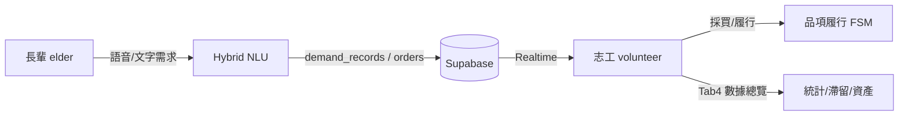

# 物資子系統架構說明 v3（論文／口試對齊版）

> 取代 v2 中「三端登入、據點管理者、GPS 路線規劃為主流程」之敘述。  
> **對外定位**：Hybrid NLU 驅動之高齡友善智慧物資代購協作系統。

---

## 1. 角色模型

| 角色 | 登入 | 物資相關能力 |
|------|------|----------------|
| 長輩 | `elder` | 柑仔店、需求單、小幫手、推薦、訂單追蹤 |
| 志工 | `volunteer` | 訂單執行、今日採買清單、履行操作、數據總覽 Tab |

- `admin`：僅 RLS／測試相容；UI 導向志工 Hub `?tab=3`。  
- `family`：家屬看單延伸，非第五章主軸。

---

## 2. NLU 分層（Hybrid）

1. **L1–L3 規則意圖**（`assistant_shop_intent_classifier.dart`）  
2. **商品對齊**（`product_items` / `product_aliases`）  
3. **信心評估**（`ShopNluResult.confidence`）  
4. **澄清**（`clarification_sessions`，槽位不足時）  
5. **可選 Edge**（`parse_shop_nlu`，confidence &lt; 0.75）

核心代購路徑**不依賴**雲端 LLM；斷網時規則 + `OfflineQueue`（Hive）仍可暫存。

---

## 3. 資料與狀態（雙軌誠實標註）

| 層級 | 欄位／表 | 用途 |
|------|---------|------|
| 訂單級 | `orders.status` | pending / processing / completed（志工主列表） |
| 品項級 | `demand_record_items.fulfillment_status` | 已購買、已發放、替代等（今日採買／履行 Sheet） |

論文與口試應說明：兩軌並行、後續 UI 統一為單一履行時間軸。

---

## 4. 志工 UI 結構

| 入口 | 內容 |
|------|------|
| `/volunteer-dashboard` Tab 0–2 | 藥單、批次代領、監測（他組） |
| `/volunteer-dashboard?tab=3` | 數據總覽（原 admin 儀表板能力） |
| `/volunteer/shop-orders` | 物資訂單、今日採買、履行 |

**不包含**：志工採買主流程中的 GPS 路線規劃（`purchase_route_planner` 保留程式、不列成果）。

---

## 5. 主要遷移與 Edge

| 檔案 | 內容 |
|------|------|
| `chapter5_shop_assistant_schema.sql` | demand、price、location、chat 檢視 |
| `20260601000000_product_catalog_and_intelligence.sql` | 商品語意、推薦 |
| `20260602000000_group_buy_collaboration.sql` | 採買聚合、澄清、履行 |
| `20260603000000_volunteer_hub_unified_role.sql` | volunteer+admin RLS |
| Edge `parse_shop_nlu` | 低信心 NLU 補強 |
| Edge `send_shop_push` | 長輩送出需求時 App invoke；原生 FCM 未接 |
| `shop_utterance_handler` | 柑仔店／需求輸入與 Hybrid NLU 統一入口 |
| `verify_shop_backend.sql` | Dashboard 自檢腳本 |

---

## 6. 與 v2 差異摘要

| 項目 | v2 敘述 | v3（現行） |
|------|---------|------------|
| 角色數 | 長輩 / 志工 / admin 三端 | **長輩 + 志工**（admin 併入 Hub） |
| 管理後台 | `/admin/dashboard` 獨立 | 志工 Tab 4 + 路由跳轉 |
| NLU | 規則式為主 | **Hybrid** + 澄清 + 可選 Edge |
| 採買組織 | 路線規劃強調 | **今日採買清單 RPC** |
| 推播 | 規劃中 | Edge 有、App **未接** |

---

*文件版本：v3 · 對齊 `features-shop` 與報告書第五章修訂。*
