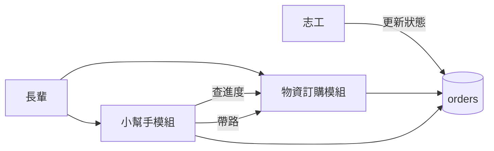
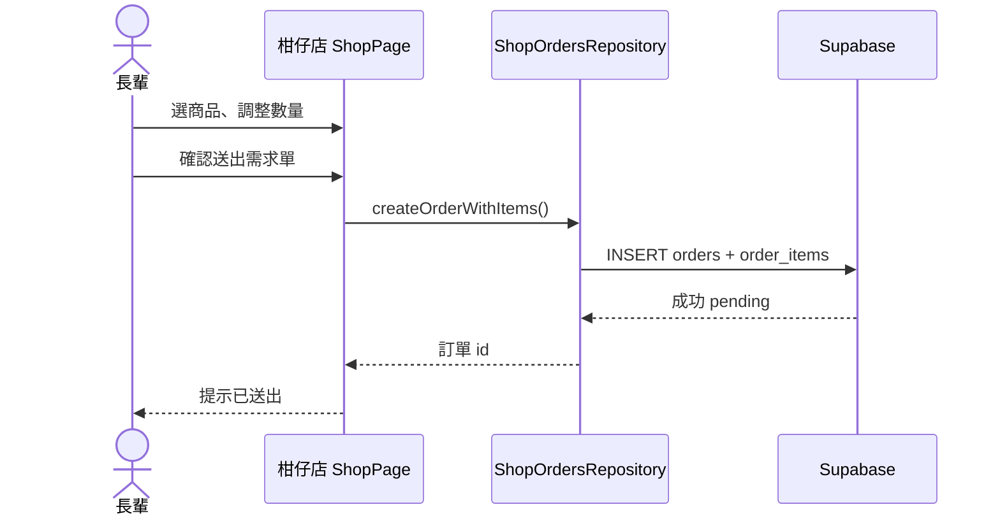
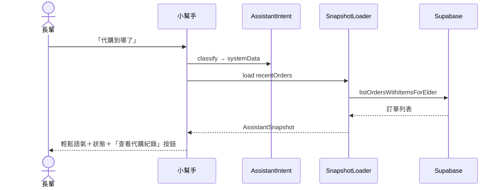
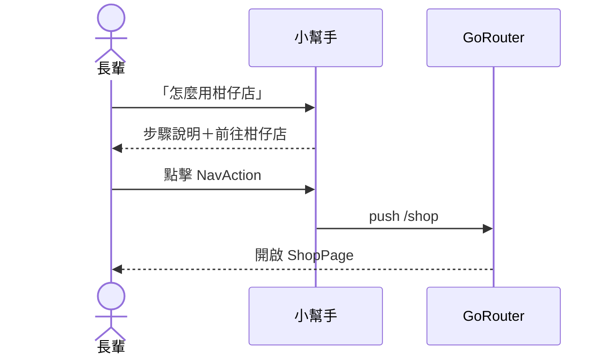
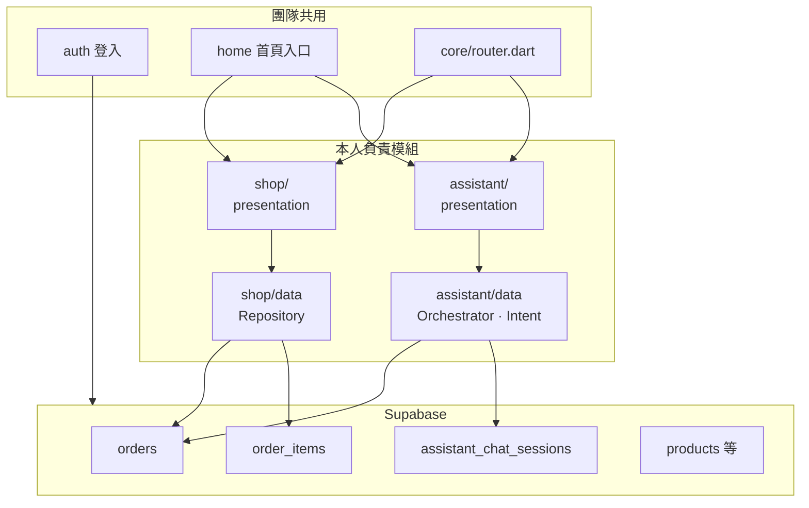
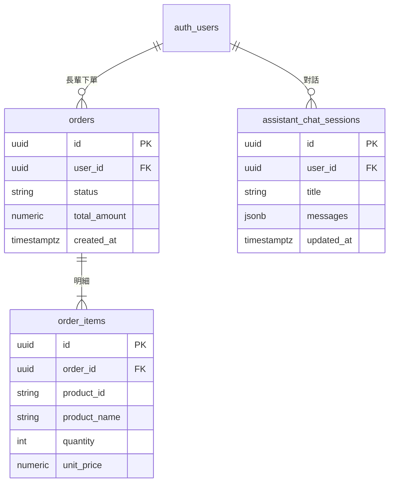
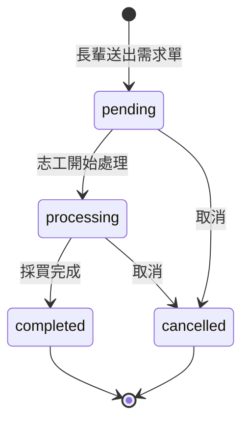
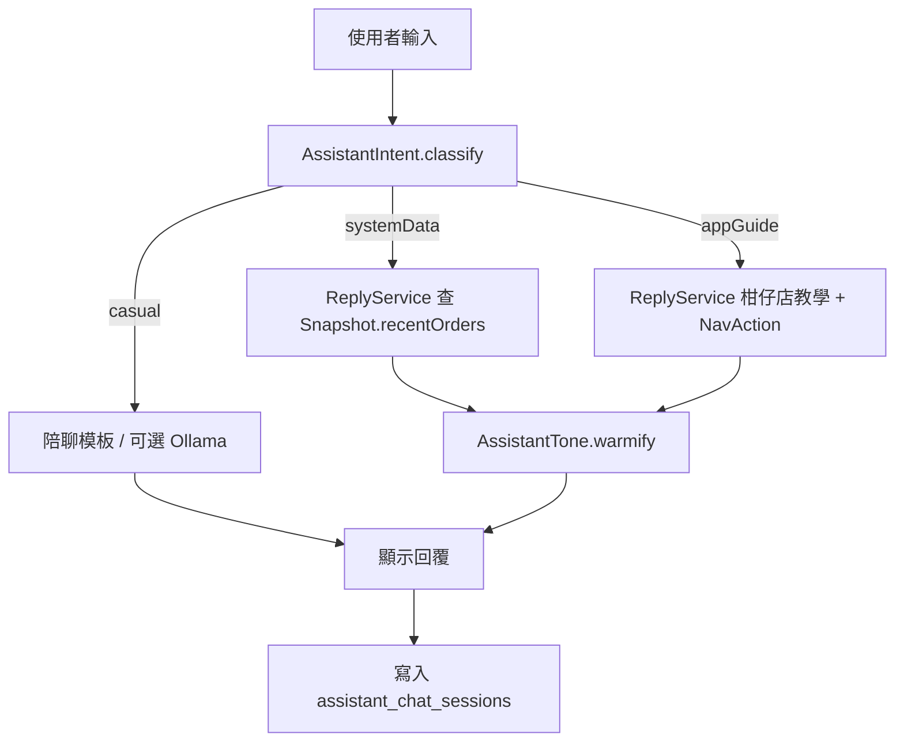

# 明德 e 達人 — 物資訂購與智慧小幫手  
## 專題成果報告書（初稿 ）


## 摘要

本報告為專題「明德 e 達人」之**個人負責成果**，著重說明本人實作之 **柑仔店物資訂購（需求單）** 與 **智慧小幫手** 兩大模組。App 整體採 Flutter 開發、Supabase 為後端；登入、健康藥單、志工儀表板等由團隊其他成員完成，本稿僅在必要處說明介接方式，不展開非本人模組之設計細節。

**物資訂購模組**讓長輩在 App 內瀏覽商品、建立代購需求單並寫入雲端 `orders`／`order_items`，可查詢個人訂單狀態，並串接全聯 pxbox 外部搜尋作價格參考。志工端可讀取需求清單並更新處理進度（RLS 權限由團隊共用 schema 定義）。

**小幫手模組**提供長輩友善對話介面：以**意圖分類**區分閒聊、查代購進度、App 帶路教學；查詢時讀取 Supabase 真實訂單資料，回覆採**輕鬆口語**而非制式客服稿；支援**語音輸入與即時字幕**、對話歷史雲端同步。不依賴付費 OpenAI，正式環境以規則引擎為主。

**關鍵詞：** 物資訂購、需求單、小幫手、Flutter、Supabase、高齡友善、Riverpod

---
## 目錄
1. [第一章 緒論]
2. [第二章 相關技術]
3. [第三章 需求分析（本人模組）]
4. [第四章 系統設計]
5. [第五章 系統實作]
6. [第六章 測試與成果]
7. [第七章 結論與未來工作]
8. [附錄：Mermaid 圖表索引]
---

## 第一章 緒論

### 1.1 研究背景

社區長輩常需請志工或親友協助採買日用品，但一般電商 App 介面複雜、購物車與促銷資訊過多，不利長輩獨立操作。同時，長輩對智慧手機的「問答、查進度」需求增加，若僅依賴電話或 LINE，志工負擔重、資訊也容易斷裂。

本專題 App「明德 e 達人」為團隊共同開發之社區服務平台。**本人負責**其中兩項與長輩日常最相關的能力：**簡化之物資需求單（柑仔店）** 與 **內建小幫手（查代購、陪聊、帶路）**。

### 1.2 研究動機

1. **訂購流程過繁：** 長輩只需「告訴社區要買什麼」，不需完整電商結帳。  
2. **進度不透明：** 送出需求後常不知道志工處理到哪一步。  
3. **操作說明不足：** 不熟悉 App 時需要口語引導與一鍵前往正確頁面。  
4. **成本限制：** 小幫手不宜依賴付費 GPT 或 24 小時自架 AI 主機。

### 1.3 研究目的

1. 實作長輩端 **物資需求單** 建立、列表與狀態查詢（Supabase 持久化）。  
2. 實作 **小幫手**：自動判斷閒聊或查系統、查詢真實代購紀錄、輕鬆語氣回覆、可帶路至柑仔店／訂單頁。  
3. 提供 **語音輸入＋即時字幕** 與 **對話歷史**（雲端＋本機備援）。  
4. 與團隊共用登入、首頁入口、志工端讀單流程介接。

### 1.4 研究範圍

| 本報告詳述（本人開發） | 團隊其他成員／僅簡述介接 |
|----------------------|--------------------------|
| 柑仔店商品列表、購物車式需求單、送出訂單 | 登入註冊、角色分流 |
| 長輩訂單紀錄頁 `/shop/orders` | 健康藥單 OCR、志工藥單任務 |
| 商品圖、全聯 pxbox 外部連結 | 交通／學習／活動分頁（占位） |
| 小幫手對話、意圖、語音、歷史 | 志工儀表板 UI（代購列表由本人 repository 提供資料層） |
| `orders`／`order_items`／`assistant_chat_sessions` 相關 App 端 | 吃藥提醒、通知排程 |

### 1.5 報告架構

第二章為技術背景；第三至五章集中於物資訂購與小幫手之需求、設計與實作；第六章為測試與成果；第七章為結論。附錄列出本稿所有 Mermaid 圖表原始碼。

---

## 第二章 相關技術

### 2.1 高齡友善設計（本模組採用）

- 柑仔店、小幫手頁面：**大字標題、大按鈕、高對比**（綠／棕／奶油色）。  
- 錯誤訊息口語化（如「暫時讀不到您的資料」）。  
- 小幫手常見問題：**點一下即可送出**，減少打字。

### 2.2 技術選型（與本模組相關）

| 技術 | 用途 |
|------|------|
| Flutter + Riverpod | 柑仔店 UI、訂單狀態、小幫手對話狀態 |
| GoRouter | `/shop`、`/shop/orders`、`/assistant` |
| Supabase | `orders`、`order_items`、`assistant_chat_sessions` |
| speech_to_text | 小幫手語音與即時字幕 |
| shared_preferences | 對話歷史離線備援 |
| url_launcher | 開啟全聯 pxbox 參考價格頁 |

### 2.3 與一般電商 App 之差異

| 項目 | 一般電商 | 本專題物資訂購 |
|------|----------|----------------|
| 交易模式 | 線上金流、配送追蹤 | **需求單**，志工現場比對採買 |
| 商品來源 | 自建庫存 | Supabase 商品表＋圖片資產 |
| 價格 | 結帳金額 | 參考全聯官網，實際以門市為準 |
| 售後查詢 | 訂單編號 | 小幫手口語查「代購到哪了」 |

---

## 第三章 需求分析（本人模組）

### 3.1 角色與本模組關係



- **長輩：** 下單、看自己的需求單、透過小幫手查進度與問操作方式。  
- **志工：** 透過團隊志工頁讀取 `orders`（本人負責 **Repository 與資料模型**）。  

### 3.2 物資訂購功能需求

| 編號 | 需求 | 優先級 | 實作狀態 |
|------|------|--------|----------|
| S-01 | 顯示商品列表（名稱、圖片、數量選擇） | 高 | 已完成 |
| S-02 | 購物車彙整、送出需求單 | 高 | 已完成 |
| S-03 | 寫入 Supabase `orders`＋`order_items` | 高 | 已完成 |
| S-04 | 長輩查詢「我的需求」列表與狀態 | 高 | 已完成 |
| S-05 | 連結全聯 pxbox 查參考價 | 中 | 已完成 |
| S-06 | 志工端讀取訂單列表（Repository） | 高 | 已完成 |
| S-07 | 志工更新訂單狀態 | 中 | 團隊志工 UI 介接本 Repository |

**訂單狀態（`order_status`）：** `pending` → `processing` → `completed`／`cancelled`

### 3.3 小幫手功能需求

| 編號 | 需求 | 優先級 | 實作狀態 |
|------|------|--------|----------|
| A-01 | 意圖分類：閒聊／查代購／帶路教學 | 高 | 已完成 |
| A-02 | 查代購時讀取 `recentOrders` 真實資料 | 高 | 已完成 |
| A-03 | 統一輕鬆語氣（`AssistantTone`） | 高 | 已完成 |
| A-04 | 「前往柑仔店」「查看代購紀錄」按鈕 | 高 | 已完成 |
| A-05 | 語音輸入＋即時字幕 | 高 | 已完成 |
| A-06 | 對話歷史（Supabase＋本機備援） | 中 | 已完成 |
| A-07 | 可選 Ollama 陪聊（開發用） | 低 | 已完成選用 |

### 3.4 使用案例

#### 案例一：長輩送出物資需求單



#### 案例二：小幫手查代購進度



#### 案例三：小幫手帶去柑仔店



---

## 第四章 系統設計

### 4.1 本人模組在整體架構中的位置



### 4.2 目錄結構

```
lib/features/shop/
├── data/
│   ├── shop_products_repository.dart    # 商品
│   ├── shop_orders_repository.dart      # 需求單 CRUD
│   ├── product_images.json              # 商品圖資產
│   └── image_proxy.dart                 # 圖片代理（開發用）
├── domain/
│   ├── shop_product.dart
│   └── shop_order_models.dart
└── presentation/
    ├── shop_page.dart                   # 柑仔店主頁
    ├── shop_elder_orders_page.dart      # 我的需求
    ├── shop_route_page.dart
    └── *_provider.dart

lib/features/assistant/
├── data/
│   ├── assistant_intent.dart            # 意圖分類
│   ├── assistant_reply_orchestrator.dart
│   ├── assistant_reply_service.dart     # 代購／帶路回覆
│   ├── assistant_casual_chat_service.dart
│   ├── assistant_tone.dart
│   ├── assistant_snapshot_loader.dart   # 含 recentOrders
│   └── assistant_history_repository.dart
└── presentation/
    ├── assistant_page.dart
    ├── assistant_provider.dart
    ├── assistant_voice_provider.dart
    └── widgets/assistant_voice_live_panel.dart

supabase/
├── orders_schema.sql
├── assistant_chat_schema.sql
└── orders_volunteer_update_rls.sql
```

### 4.3 資料庫設計（與本人模組相關）



**RLS 原則（摘要）：** 長輩僅能讀寫自己的 `orders`；志工依團隊 policy 可讀取訂單並更新狀態；對話紀錄僅本人可見。

### 4.4 訂單狀態流程



### 4.5 小幫手回覆流程（統一輕鬆語氣）



**與物資訂購的關聯：** `AssistantSnapshotLoader` 呼叫 `ShopOrdersRepository.listOrdersWithItemsForElder()`，小幫手回答「代購到哪」時**不捏造**，以 DB 為準。

---

## 第五章 系統實作

### 5.1 物資訂購模組

#### 5.1.1 商品展示

- `shopProductsProvider` 載入商品；圖片由 `product_images.json` 或 Supabase 對應。  
- 卡片顯示品名、數量 stepper、加入需求清單。  
- 可開啟 **全聯 pxbox** 搜尋結果頁作價格參考（`url_launcher`）。

#### 5.1.2 送出需求單

- `ShopOrdersRepository.createOrderWithItems()`：  
  - 建立 `orders`（`status = pending`，`total_amount` 為明細加總）。  
  - 批次寫入 `order_items`（`product_id`、`product_name`、`quantity` 等）。  
- 成功後清空購物車狀態並提示長輩。

#### 5.1.3 我的需求

- 路由 `/shop/orders`，`ShopElderOrdersPage` 列出個人訂單。  
- 顯示狀態中文標籤、時間、品項摘要。  
- 下拉重新整理。

#### 5.1.4 志工端資料層（介接）

- `listOrdersWithItemsForVolunteer()`：含長輩姓名、電話（需 profiles 讀取權限）。  
- `updateOrderStatus()`：更新 `processing`／`completed` 等（志工 UI 由隊友實作，呼叫本 Repository）。

### 5.2 小幫手模組

#### 5.2.1 意圖分類（`assistant_intent.dart`）

| 類型 | 觸發例 | 處理 |
|------|--------|------|
| casual | 「最近好嗎」 | 陪聊，不查 DB |
| systemData | 「代購到哪」「訂單怎麼了」 | 查 `recentOrders` |
| appGuide | 「怎麼用柑仔店」「柑仔店在哪」 | 教學＋`/shop` 按鈕 |

閒聊優先：避免「最近好嗎」被誤判為查資料。

#### 5.2.2 回覆編排（`assistant_reply_orchestrator.dart`）

1. `classify(question)`  
2. casual → `AssistantCasualChatService`  
3. 否則 → `AssistantReplyService` → `AssistantTone.warmify()`  
4. 回傳 `AssistantReply`（文字＋`AssistantNavAction` 列表）

代購相關 NavAction 範例：`/shop`、`/shop/orders`。

#### 5.2.3 語音與字幕

- `assistant_voice_provider`：`speech_to_text` 即時辨識。  
- `AssistantVoiceLivePanel`：脈動麥克風、音量條、大字幕、確認／取消。  
- 結束後可自動填入輸入框並送出。

#### 5.2.4 對話歷史

- 表 `assistant_chat_sessions`（需執行 `assistant_chat_schema.sql`）。  
- `assistant_history_repository`：Supabase 優先，失敗時 `SharedPreferences`。  
- 側邊欄：進行中、今天、昨天、日期分組；可刪除、繼續對話。  
- 離開頁面**不**強制結案，僅同步；「新對話」才存檔換場次。

### 5.3 與首頁的介接（團隊）

- 首頁 `_ChatShortcutCard` → `context.push('/assistant')`。  
- 底部導覽「柑仔店」→ `ShopRoutePage`／`ShopPage`。  
- 小幫手帶路可使用 `/home?tab=1` 切換至柑仔店分頁（團隊路由已支援）。

---

## 第六章 測試與成果

### 6.1 測試環境

- Flutter 3.11+、`flutter run -d chrome --web-port=8080`  
- Supabase 已執行 `orders_schema.sql`、`assistant_chat_schema.sql`  

### 6.2 功能測試（本人模組）

| 編號 | 測試項目 | 預期結果 | 結果 |
|------|----------|----------|------|
| T-S01 | 瀏覽商品並加入清單 | 清單數量正確 | □ |
| T-S02 | 送出需求單 | DB 有 orders／order_items | □ |
| T-S03 | 我的需求列表 | 顯示 pending 與品項 | □ |
| T-S04 | 開啟全聯 pxbox | 外部瀏覽器開啟搜尋 | □ |
| T-S05 | 志工更新狀態後長輩刷新 | 狀態變 processing／completed | □ |
| T-A01 | 「代購到哪了」 | 顯示最新訂單狀態 | □ |
| T-A02 | 「最近好嗎」 | 陪聊語氣，非功能列表 | □ |
| T-A03 | 「怎麼用柑仔店」 | 教學＋前往按鈕有效 | □ |
| T-A04 | 語音輸入 | 字幕即時、可送出 | □ |
| T-A05 | 新對話與歷史 | 側邊欄可見、可刪除 | □ |

### 6.3 成果展示（請插入截圖）

> **圖 6-1** 柑仔店商品列表與購物車  
> **圖 6-2** 送出需求單／成功提示  
> **圖 6-3** 我的需求訂單列表  
> **圖 6-4** 小幫手查代購進度（含按鈕）  
> **圖 6-5** 小幫手陪聊與常見問題  
> **圖 6-6** 語音即時字幕面板  

### 6.4 量化指標（可選填）

| 指標 | 數值 |
|------|------|
| shop 模組 Dart 檔案數 | 約 ○ 個 |
| assistant 模組 Dart 檔案數 | 約 ○ 個 |
| 完成下單平均步驟 | 約 ○ 步 |
| 小幫手代購查詢正確率（測試句） | ○／○ 句 |

---

## 第七章 結論與未來工作

### 7.1 結論

本人於專題中完成 **物資需求單訂購流程** 與 **智慧小幫手** 兩大模組，使長輩能以簡化步驟送出代購需求、查詢真實進度，並以語音與輕鬆對話降低使用門檻。資料皆存於 Supabase，與志工端透過共用 `orders` 表協作；小幫手以意圖分類與規則引擎達成「不付費 API 仍可查真實訂單」之目標。

### 7.2 困難與解決

| 困難 | 解決 |
|------|------|
| `order_status` 與程式字串不一致 | `order_status_enum_fix.sql`、常數 `initialOrderStatus` |
| 小幫手離開頁即結案 | 改為僅新對話／換帳號存檔 |
| 閒聊被誤判查資料 | `AssistantIntent` 閒聊優先規則 |
| Web 語音權限 | Chrome localhost 測試說明 |

### 7.3 未來改進（本人模組）

1. 需求單 **備註欄**（目前 DB 無 note，可擴 schema）。  
2. 小幫手 **追問「那上一筆呢」** 上下文。  
3. 小幫手 **TTS 朗讀**回覆。  
4. 商品 **離線快取**、弱網提示。  
5. 訂單狀態變更 **推播** 通知長輩（與團隊通知模組整合）。

### 7.4 心得（請填寫 300～500 字）

（說明負責物資訂購與小幫手之學習、與隊友介接 Supabase／首頁之經驗。）

---

## 附錄：Mermaid 圖表索引

以下圖表已嵌入正文；亦可單獨複製至 [Mermaid Live](https://mermaid.live) 匯出 PNG。

| 圖號 | 說明 | 所在章節 |
|------|------|----------|
| 圖 3-1 | 角色與模組關係 | §3.1 |
| 圖 3-2～3-4 | 三個使用案例時序圖 | §3.4 |
| 圖 4-1 | 本人模組架構 | §4.1 |
| 圖 4-2 | ER 圖（orders／對話） | §4.3 |
| 圖 4-3 | 訂單狀態 | §4.4 |
| 圖 4-4 | 小幫手流程 | §4.5 |

### 附錄 A　安裝與執行

```bash
cd smart_bp-main
flutter pub get
# Supabase SQL Editor 執行：
#   orders_schema.sql
#   assistant_chat_schema.sql
flutter run -d chrome --web-port=8080
```

### 附錄 B　參考文獻

1. Flutter Documentation, https://docs.flutter.dev/  
2. Supabase Documentation, https://supabase.com/docs  
3. Riverpod Documentation, https://riverpod.dev/  

---
**— 初稿結束（物資訂購＋小幫手專版）—**
